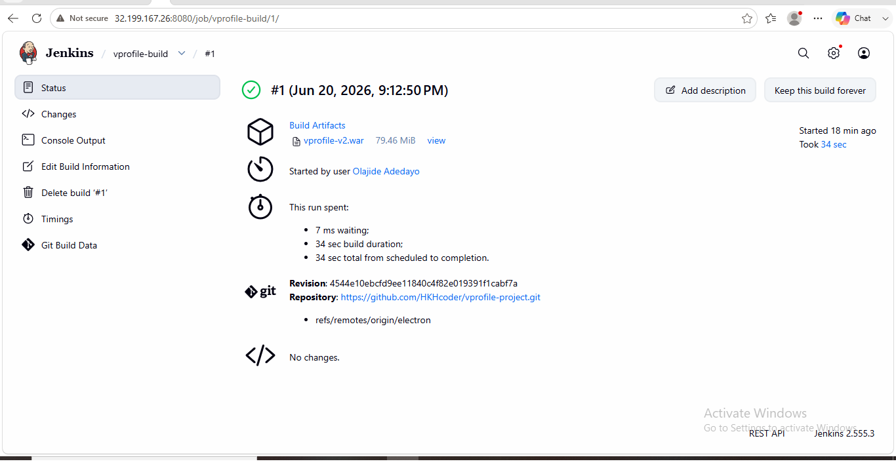
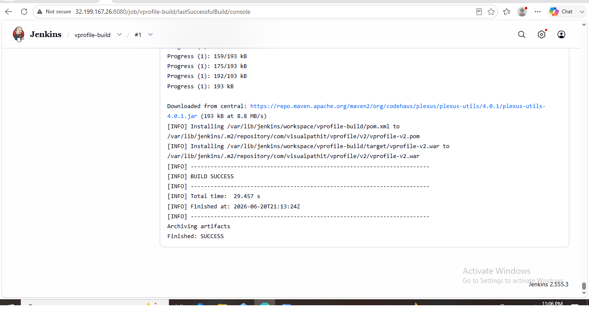
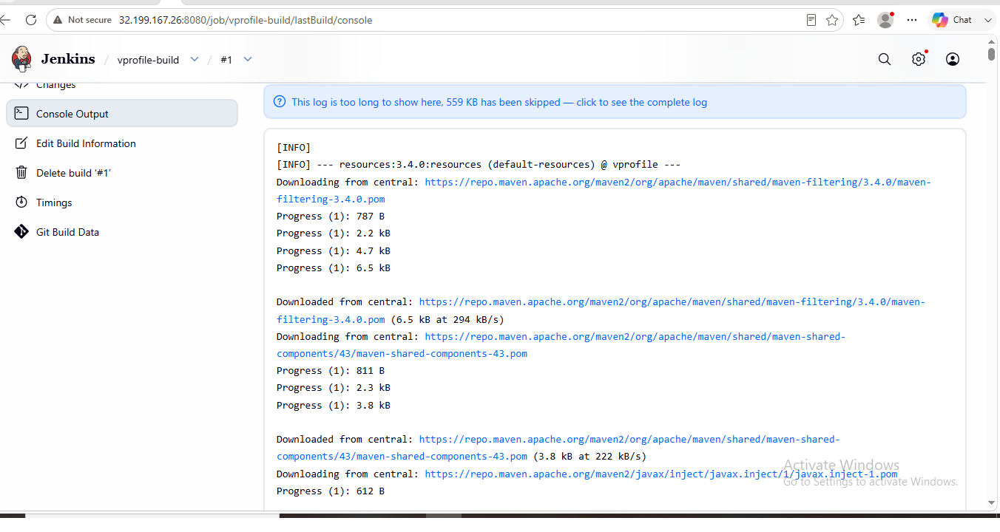
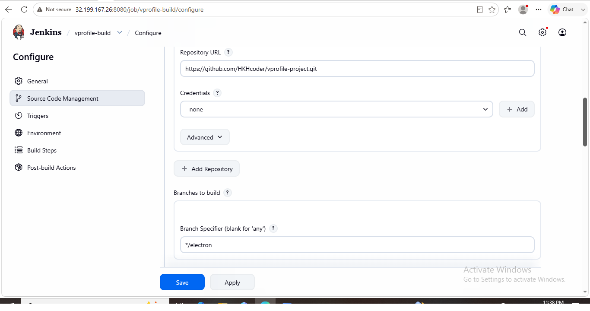
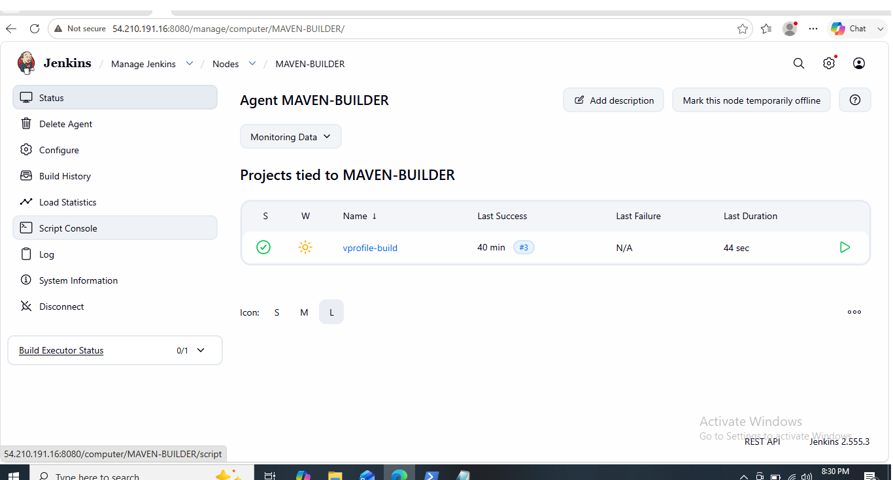
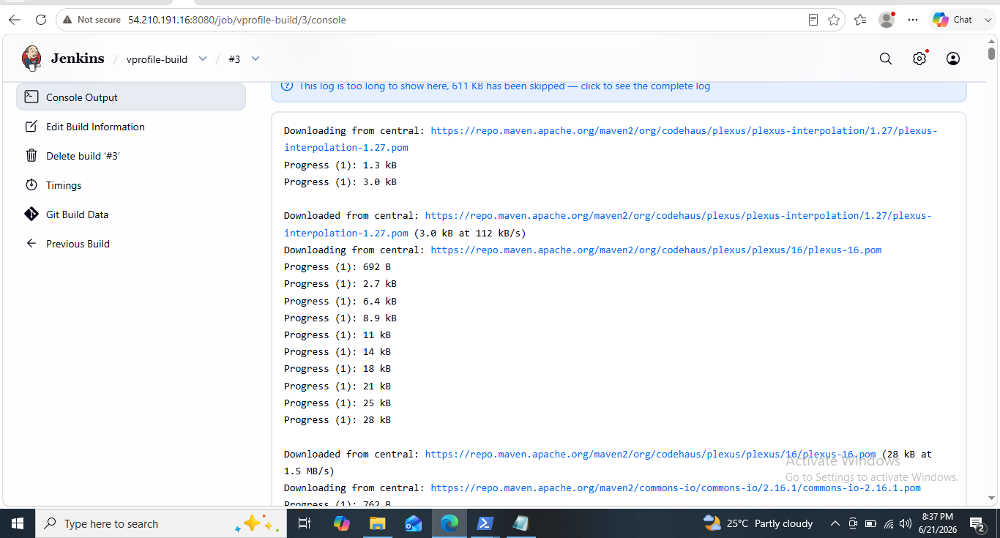
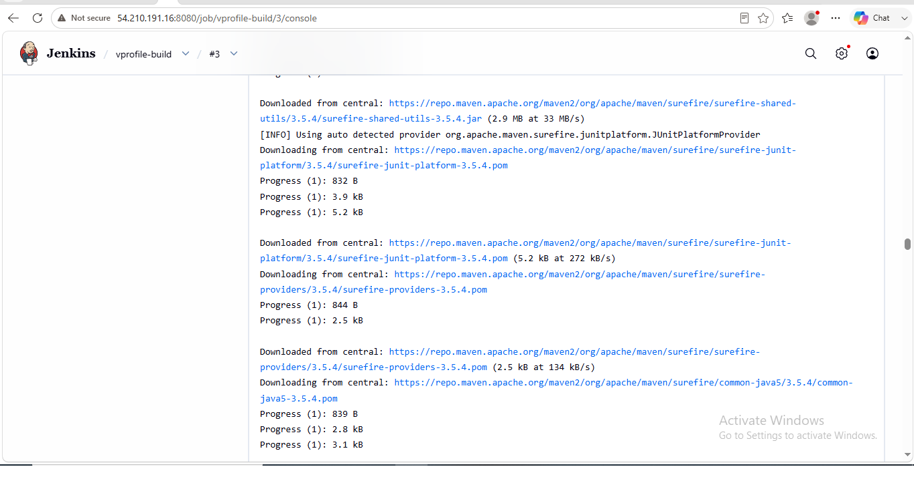
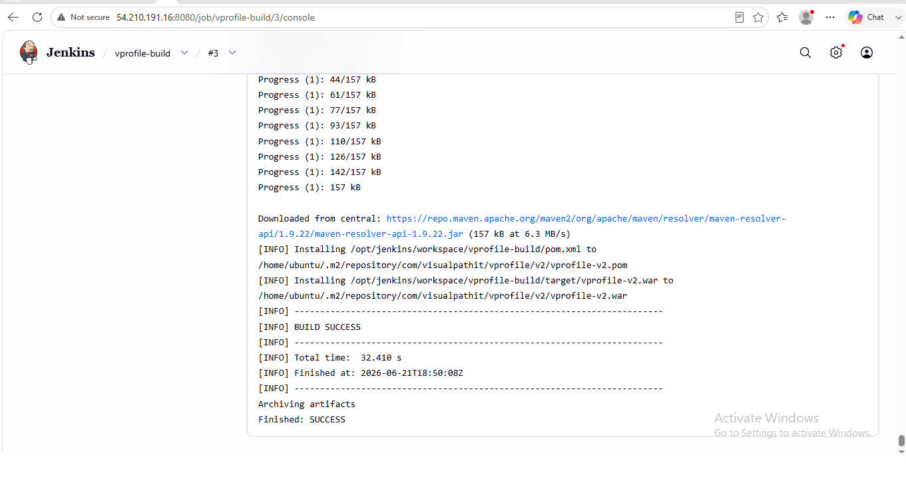

# 🚀 Jenkins-Based Continuous Integration (CI) Pipeline with Distributed Build Architecture on AWS

## 📌 Project Overview

This project demonstrates the implementation of a *Continuous Integration (CI) pipeline using Jenkins on AWS*, designed to automate source code integration, build execution, testing, and artifact generation for a Java-based web application.

The pipeline was initially implemented as a traditional Jenkins build system and later extended into a *distributed build architecture using a dedicated Jenkins Agent deployed on AWS EC2*.

This setup simulates a real-world DevOps CI environment where build workloads are separated between a Jenkins Controller and multiple build Agents for improved scalability and performance.

## 🎯 Business Objective

To design and implement an automated Continuous Integration (CI) pipeline that:

- Integrates source code from GitHub
- Automates Maven-based build lifecycle
- Compiles and tests application code
- Generates deployable WAR artifacts
- Implements distributed build execution using Jenkins Agent architecture
- Demonstrates scalable, production-like CI/CD workflow on AWS infrastructure

## 🛠️ Technologies Used

- Jenkins (CI/CD Automation Server)
- AWS EC2 (Cloud Infrastructure)
- Ubuntu Linux (Operating System)
- Git (Version Control System)
- GitHub (Source Code Repository)
- Maven (Build Automation Tool)
- Java OpenJDK 21 (Application Runtime)
- SSH (Secure Remote Communication)
- Maven Central Repository (Dependency Management)

## ☁️ AWS Infrastructure

### Jenkins Controller Server
- AWS EC2 Instance
- Ubuntu Linux
- Jenkins Installed and Configured
- Git & Maven Integration Enabled

### Jenkins Agent Server (Maven Builder)
- AWS EC2 Instance
- Ubuntu Linux
- OpenJDK 21 Installed
- Configured as Jenkins Build Agent
- Connected via SSH to Jenkins Controller
- Assigned Label: MAVEN-BUILDER

## ⚙️ Jenkins Configuration

### Installed Tools in Jenkins

- JDK: OpenJDK 21 configured in Global Tool Configuration  
- Maven: Maven 3.9.x configured for build automation  
- Git: Installed on Jenkins Controller for source code retrieval  
- SSH Client: Used internally by Jenkins for agent connectivity via SSH  

---

### Jenkins Node Configuration (Agent Setup)

- Node Name: MAVEN-BUILDER  
- Remote Root Directory: /opt/jenkins  
- Launch Method: SSH (Launch agents via SSH)  
- Credentials: SSH Username with Private Key (ubuntu user)  
- Host Key Verification Strategy: Non-verifying strategy  
- Label: MAVEN-BUILDER  
- Number of Executors: 1 (controlled resource usage for build stability)  

---

### AWS EC2 Infrastructure Supporting Jenkins

#### Jenkins Controller Server
- Ubuntu Linux (EC2 Instance)  
- Jenkins Installed and Running  
- Git Installed  
- Java (OpenJDK 21) Installed  

#### Jenkins Build Agent (Maven Agent)
- Ubuntu Linux (EC2 Instance)  
- OpenJDK 21 Installed  
- Remote workspace configured at /opt/jenkins  
- Connected to Jenkins Controller via SSH  

---

### Job Configuration

- Source Code Management: GitHub integration  
- Repository URL: https://github.com/HKHcoder/vprofile-project.git  
- Build Trigger: Manual execution  
- Build Tool: Maven  
- Build Goal: mvn install  
- Execution Mode: Restricted to MAVEN-BUILDER node (Distributed Build Architecture)  
- Artifact Generated: WAR file (vprofile-v2.war)  

---

### Build Output

- Artifact Location: target/vprofile-v2.war  
- Build Status: SUCCESS  
- Artifact Archiving: Enabled in Jenkins

## 🔄 Continuous Integration (CI) Pipeline Workflow

The CI pipeline was implemented using Jenkins to automate the full build lifecycle of a Java web application hosted on GitHub.

---

### Pipeline Flow

1. Developer commits and pushes code to GitHub repository  
2. Jenkins job is triggered manually (configured for CI execution)  
3. Jenkins pulls the latest source code from the GitHub repository  
4. Maven resolves all project dependencies from Maven Central Repository  
5. Source code is compiled into bytecode  
6. Automated unit tests are executed using Maven Surefire plugin  
7. Application is packaged into a WAR file (web application artifact)  
8. Jenkins archives the generated artifact for future use  
9. Build is executed on a dedicated Jenkins Agent (MAVEN-BUILDER node) instead of the controller  
10. Build status is reported back to the Jenkins dashboard  

---

### Maven Build Lifecycle Executed

The following Maven phases were executed during the pipeline:

text
clean → validate → compile → test → package → install

### Maven Command Used

bash
mvn clean install

### Output Generated

- Artifact: vprofile-v2.war
- Location: target/vprofile-v2.war
- Build Status: SUCCESS
- Artifact Archiving: Enabled via Jenkins post-build actions

### Key Note

This CI pipeline demonstrates a *distributed build execution model*, where Jenkins offloads build processing to a dedicated agent (MAVEN-BUILDER).

This improves:

- Build scalability
- Performance efficiency
- Separation of concerns between Controller and Agent

---

## 🏗️ Distributed Build Architecture

This project implements a *Jenkins Distributed Build Architecture* to improve scalability, performance, and separation of responsibilities between the Jenkins Controller and Build Agent.

---

### Architecture Overview

#### Jenkins Controller Responsibilities

- Job scheduling
- Source code management integration
- Build orchestration
- Agent management

#### Jenkins Agent (MAVEN-BUILDER) Responsibilities

- Executing Maven build jobs
- Compiling source code
- Running automated tests
- Generating WAR artifacts

---

### Execution Flow

text
GitHub Repository
        │
        ▼
Jenkins Controller (AWS EC2)
        │
        │ SSH Connection
        ▼
Jenkins Agent (AWS EC2 - MAVEN-BUILDER)
        │
        ▼
Maven Build Execution
        │
        ▼
WAR Artifact Generation
        │
        ▼
Artifact Archiving in Jenkins

### Key Configuration

- Agent Label: MAVEN-BUILDER
- Remote Root Directory: /opt/jenkins
- Launch Method: SSH
- Execution Mode: Restricted to agent node
- Build Execution: Offloaded from Controller to Agent

---

### Benefits of This Architecture

- Improved build performance by offloading workload from the controller
- Better scalability for future agent expansion
- Clear separation of responsibilities between Controller and Agent
- Simulates real-world enterprise CI/CD environments
- Reduced resource utilization on the Jenkins Controller

## 🐧 Linux Commands Used

The following Linux commands were used while preparing, verifying, and managing the Jenkins Build Agent environment.

### Update Package Repository

bash
sudo apt update

### Install Java 21

bash
sudo apt install openjdk-21-jdk -y

### Verify Java Installation

bash
java -version

### Create Jenkins Working Directory

bash
sudo mkdir -p /opt/jenkins

### Assign Directory Ownership

bash
sudo chown ubuntu:ubuntu /opt/jenkins

### Verify Directory Permissions

bash
ls -ld /opt/jenkins

### Verify Current Logged-in User

bash
whoami

### Verify Current Working Directory

bash
pwd

### Display Logged-in Users and System Activity

bash
w

### Display User and Group Information

bash
id

### Verify SSH Connectivity from Jenkins Controller to Agent (Manual Validation)

bash
ssh -i <private-key>.pem ubuntu@<Agent-Public-IP>

### Verify Maven Installation

bash
mvn -version

### Verify Git Installation

bash
git --version

### Verify Java Installation Path

bash
which java

### Verify Maven Installation Path

bash
which mvn

### Purpose of These Commands

- Update the Ubuntu package repository
- Install and verify OpenJDK 21
- Prepare the Jenkins Agent build environment
- Create a dedicated Jenkins workspace directory
- Configure proper ownership and permissions
- Verify user identity and system information
- Confirm SSH connectivity between Jenkins Controller and Agent
- Validate Maven and Git installations
- Verify software installation paths
- Ensure the Jenkins Agent is ready for distributed build execution

## 📦 Artifact Generation

The CI pipeline generates a deployable *WAR (Web Application Archive)* file as the final build output.

### Build Process Output

- Application Type: Java Web Application  
- Build Tool: Maven  
- Packaging Format: WAR  

### Generated Artifact

text
vprofile-v2.war

### Artifact Location

text
target/vprofile-v2.war

### Jenkins Artifact Handling

- Artifact is automatically generated after successful Maven build  
- Stored in Jenkins workspace on the build agent  
- Archived in Jenkins for future deployment or download  
- Verified through Jenkins Build History console output

## 🚧 Challenges Encountered & Troubleshooting

During the implementation of this CI pipeline, several challenges were encountered and resolved as part of real-world DevOps troubleshooting experience.

---

### 1. Jenkins Agent Credential Issue

*Problem:*
SSH credentials for the Jenkins agent were not appearing in the Jenkins node configuration dropdown.

*Cause:*
Credentials were not correctly scoped under Global Credentials Store.

*Solution:*
- Re-created SSH credentials using "SSH Username with Private Key"
- Ensured username was set to ubuntu
- Saved credentials in Global scope
- Re-selected credentials in Jenkins node configuration

---

### 2. Jenkins Agent Connection Failure

*Problem:*
Jenkins was unable to establish SSH connection to the EC2 agent.

*Cause:*
Security group did not allow inbound SSH (port 22) from Jenkins controller.

*Solution:*
- Updated AWS Security Group rules
- Allowed SSH (port 22) from Jenkins controller IP
- Reconnected Jenkins agent successfully

---

### 3. Maven Build Failure Due to Java Version

*Problem:*
Maven build failed initially on the agent node.

*Cause:*
Incorrect or missing Java installation on the agent.

*Solution:*
- Installed OpenJDK 21
- Verified with java -version
- Reconfigured JAVA_HOME if required

---

### 4. Build Running on Controller Instead of Agent

*Problem:*
Jenkins job was executing on the controller instead of the agent.

*Cause:*
No label restriction applied to job configuration.

*Solution:*
- Configured node label: MAVEN-BUILDER
- Enabled "Restrict where this project can be run"
- Ensured execution on agent only

---

### 5. Maven Dependency Download Delay

*Problem:*
Initial builds took longer due to dependency downloads.

*Solution:*
- Maven cache populated after first successful build
- Subsequent builds executed faster

---

### Key Learning

These challenges helped reinforce real-world DevOps skills in:

- Jenkins distributed architecture
- AWS EC2 configuration
- Linux server troubleshooting
- Maven build lifecycle management
- CI/CD pipeline debugging

## 🏆 Key Achievements

This project demonstrates a complete end-to-end CI pipeline implementation using Jenkins and AWS, with real-world DevOps practices.

---

### Core Achievements

- Successfully implemented a Jenkins-based Continuous Integration (CI) pipeline  
- Integrated Jenkins with GitHub for automated source code management  
- Configured Maven build automation for Java web application  
- Generated deployable WAR artifacts using automated build process  
- Implemented Jenkins distributed build architecture using EC2-based agent  
- Established secure SSH communication between Jenkins Controller and Agent  
- Offloaded build execution from controller to dedicated build agent  
- Improved build scalability and system performance  

---

### Infrastructure Achievements

- Provisioned AWS EC2 instances for Jenkins Controller and Agent  
- Configured Linux-based build environment on Ubuntu servers  
- Installed and configured OpenJDK 21 and Maven  
- Managed SSH-based secure connectivity between servers  
- Configured Jenkins node labeling for controlled job execution  

---

### DevOps Skills Demonstrated

- CI/CD pipeline design and implementation  
- Jenkins job configuration and automation  
- Maven build lifecycle management  
- Git & GitHub integration  
- AWS EC2 infrastructure provisioning  
- Linux system administration  
- SSH authentication and secure communication  
- Distributed build architecture design

## 📸 Screenshots

### Jenkins CI Pipeline (Core Build)

  
  
  
  

---

### Jenkins Distributed Build (Agent Execution)

  
  
  

---

### Verification Notes

- All builds executed successfully on Jenkins Agent  
- Artifact generation confirmed via Jenkins console output  
- Distributed architecture validated through node label execution  
- SSH-based communication between Controller and Agent verified

## 📘 Lessons Learned

This project provided hands-on experience in building and managing a real-world CI pipeline using Jenkins and AWS.

Key learnings include:

- Understanding Jenkins Controller vs Agent architecture
- Implementing distributed build systems for scalability
- Managing Linux-based build environments on AWS EC2
- Configuring secure SSH-based communication between systems
- Automating Java builds using Maven
- Troubleshooting CI pipeline failures in real time
- Structuring production-grade DevOps documentation

---

## 🚀 Future Improvements

- Add Continuous Deployment (CD) stage using AWS EC2 or Docker
- Integrate Docker for containerized builds
- Implement Jenkins Pipeline as Code (Jenkinsfile)
- Add automated testing and code quality analysis (SonarQube)
- Integrate notifications (Slack / Email alerts)
- Deploy artifact to AWS S3 or Nexus Repository

---

## 👨‍💻 Author

*Name:* Olajide Adedayo  
*GitHub:* https://github.com/olajide-adedayo  
*Project Repository:* https://github.com/olajide-adedayo/jenkins-distributed-ci-pipeline-aws  

---

## ⭐ Project Impact

This project demonstrates:

✔️ Real-world CI/CD pipeline design  
✔️ Cloud infrastructure usage (AWS EC2)  
✔️ DevOps automation principles  
✔️ Scalable Jenkins architecture  
✔️ Production-style documentation  

It is part of a growing DevOps portfolio focused on cloud engineering and automation.
